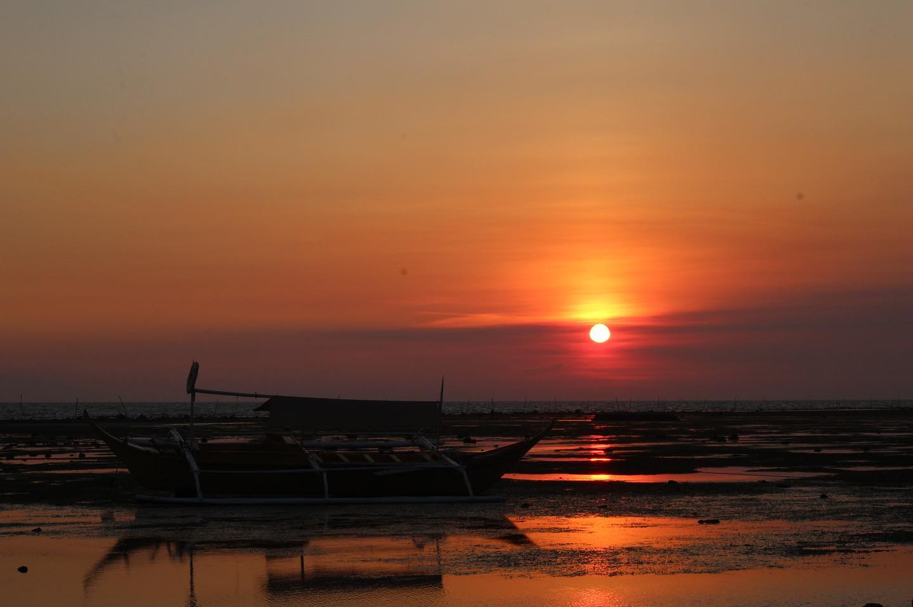
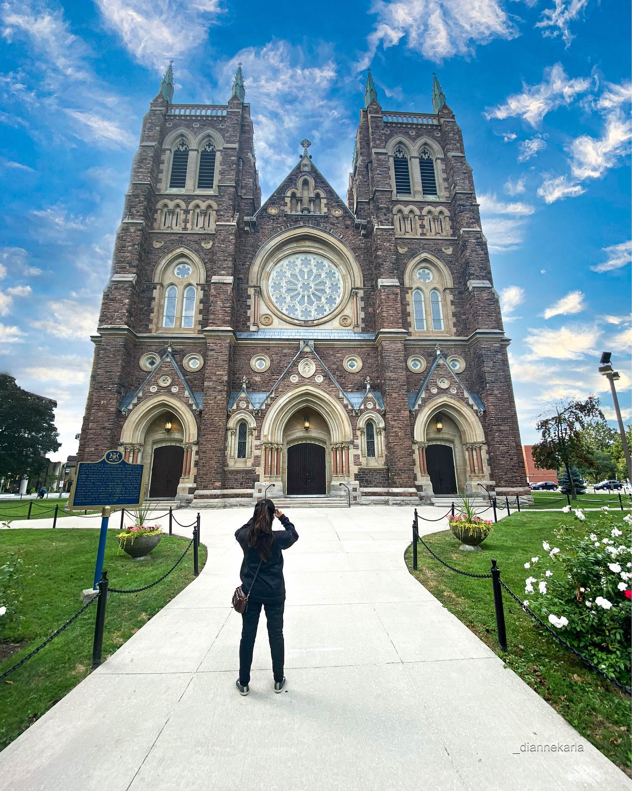

# Super Duper The Future Front-end Developer Team

## Kim, Hyeongtae

I am from Seoul, Korea, and living in London ON now with my wife. 
I came to Canada last September so it has been exactly one year. 
All I can talk about my hobby is that I like reading, learning, movies, 
and traveling the most. 

I have traveled to quite some countries around the world on vacation and on business trips. 
Travel is like stepping into completely different places and cultures. 
Certainly, these travel experiences are of great help in expanding 
the breadth and depth of my thinking as well as an understanding of the world.

### Favourites
* Baseball 
* Books 
* Movies 
* Korean Galbi

### Skills
* Adobe Creative Suite (Photoshop, Illustrator, Indesign)
* SketchUp
* 3D MAX
* V-Ray Render
* Drawing

### My Works

==================================================================

## Trabuco, Dianne
I was born and raised in the Philippines. 
I moved to Canada two months ago and am now working as a part-time student 
at a fast food restaurant. 
My hobbies are editing and photography, but I want to broaden my knowledge of being a creative, 
which is why I took Interactive Media Design.

I also enjoy cooking and swimming. Spinach, is my only pet. He's such a cute and adoble pup. 
I miss going for walks and cuddling with him.

### Favourites
* Editing Pictures 
* Recording Videos  
* Cooking 
* Swimming
* Reading Books

### Skills
* Portrait
* Landscape
* Pets
* Food

### My Works

## Contributing

	1. Fork it!
	2. Create your feature branch: `git checkout -b my-new-feature`
	3. Commit your changes: `git commit -m 'Add some feature'`
	4. Push to the branch: `git push origin my-new-feature`
	5. Submit a pull request :D

## Credits

Kim, Hyeongtae: eugene-h-kim
Trabuco, Dianne: diannekarla

## License
MIT